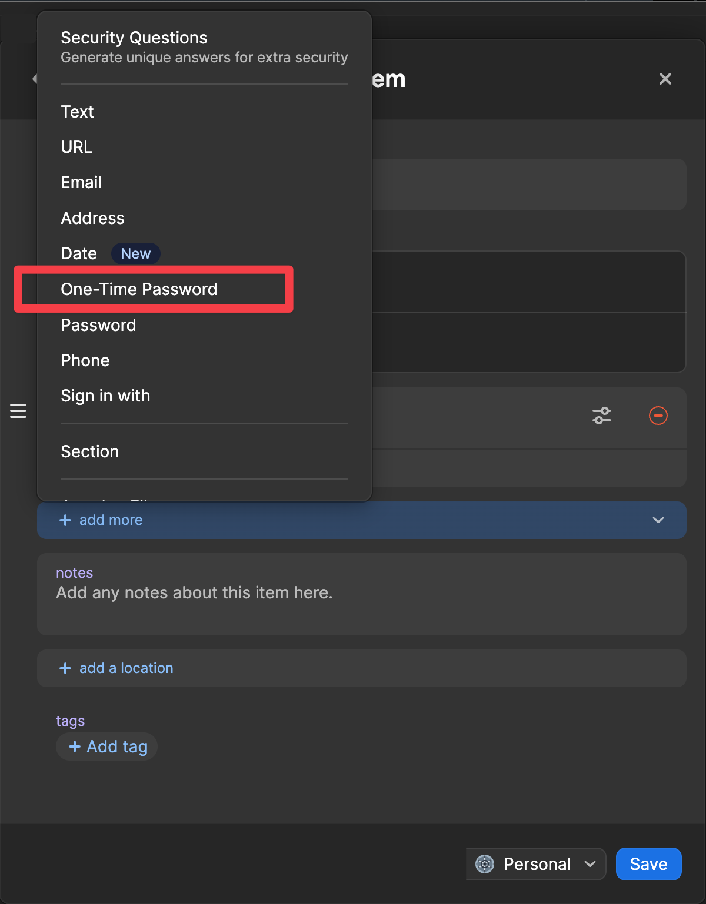

# PocketChest Deployment Guide

This guide walks you through deploying PocketChest, a secure file-sharing application built with Next.js and Cloudflare Workers.

## Architecture Overview

- **Frontend**: Next.js 14 app deployed on Cloudflare Pages
- **Backend**: Cloudflare Worker with D1 database and R2 storage
- **Authentication**: Optional TOTP (Time-based One-Time Password)

## Prerequisites

- [Cloudflare account](https://cloudflare.com/) (free tier works)
- [Wrangler CLI](https://developers.cloudflare.com/workers/wrangler/) installed globally

```bash
npm install -g wrangler
wrangler login
```

## Backend Deployment (Cloudflare Worker)

### 1. Set Up Configuration Files

#### Copy Template Files

```bash
# Copy configuration templates
cd droply-backend
cp wrangler.jsonc.template wrangler.jsonc

cd ../droply-frontend
cp .env.local.template .env.local
```

#### Create D1 Database

```bash
cd ../droply-backend
wrangler d1 create droply
```

Save the database ID from the output. Update `droply-backend/wrangler.jsonc`:

```jsonc
{
  "d1_databases": [
    {
      "binding": "DB",
      "database_name": "droply",
      "database_id": "<your-database-id-here>"
    }
  ]
}
```

#### Create R2 Bucket

```bash
wrangler r2 bucket create droply
```

Update `droply-backend/wrangler.jsonc` with the bucket binding:

```jsonc
{
  "r2_buckets": [
    {
      "bucket_name": "droply",
      "binding": "R2_STORAGE"
    }
  ]
}
```

### 2. Initialize Database Schema

```bash
# From droply-backend directory
wrangler d1 execute droply --file=src/schema.sql --remote
```

### 3. Configure Custom Domain (Optional)

**Using Routes in wrangler.jsonc**

If you have a domain managed by Cloudflare, you can configure a custom domain route directly in your `wrangler.jsonc`:

```jsonc
{
  "routes": [
    {
      "pattern": "api-pc.yourdomain.com",
      "custom_domain": true
    }
  ],
  "workers_dev": false  // Optional: disable default *.workers.dev domain
}
```

**Workers.dev Domain Control:**
- By default, your Worker will be accessible at both your custom domain AND `your-worker-name.your-subdomain.workers.dev`
- To disable the default workers.dev domain, set `"workers_dev": false` in your `wrangler.jsonc`
- When `workers_dev` is false, your Worker will ONLY be accessible via your custom domain routes. This is recommended for production deployments where you want to use only your custom domain
- **⚠️ China Access**: The default `*.workers.dev` domain is not accessible from China. If you need China accessibility, you must use a custom domain

**Requirements:**
- Your domain must be added to Cloudflare (as a zone)
- **Do NOT configure DNS records beforehand** - Cloudflare will handle this automatically during deployment
- **Important**: Use a subdomain (3-level domain like `api.yourdomain.com`) for automatic SSL certificates
- Avoid deeper subdomains (4+ levels like `api.pc.yourdomain.com`) as they won't receive automatic SSL certificates due to Cloudflare limitations

### 4. Configure Secrets

**⚠️ IMPORTANT**: Never put secrets in `wrangler.jsonc` vars section - use Cloudflare Worker Secrets ([docs](https://developers.cloudflare.com/workers/configuration/secrets/)) instead.

#### Generate Secrets

Use the provided script to generate secure secrets:

```bash
cd droply-backend/scripts

# Generate JWT + single TOTP user
node generate-secrets.js [key-name]

# Generate JWT + multiple TOTP users
node generate-secrets.js admin user1 user2 user3

# Generate only TOTP keys (for adding users later)
node generate-secrets.js --totp-only newuser1 newuser2
```

**Script Features:**
- **JWT_SECRET**: Secure random key for token signing. You should use a randomly generated JWT secret for security.
- **Multiple TOTP Users**: Generate multiple users at once with setup instructions
- **Add Users Later**: Use `--totp-only` flag to generate additional TOTP keys

**Multiple Users Supported**: The TOTP system supports unlimited users with different TOTP secrets. Format: `key1:secret1,key2:secret2,key3:secret3`. Any user with a valid TOTP token can access the system.

#### Configure Secrets and Variables
**1. Configure TOTP Setting in `droply-backend/wrangler.jsonc`:**

```jsonc
{
  "vars": {
    "REQUIRE_TOTP": "true"    // Set to "false" to disable TOTP
  }
}
```

**2. Set Cloudflare Worker Secrets:**

```bash
# From droply-backend directory

# Set JWT secret (REQUIRED)
wrangler secret put JWT_SECRET
# Paste the JWT secret from the generator when prompted

# Set TOTP secrets (ONLY if REQUIRE_TOTP is "true")
wrangler secret put TOTP_SECRETS
# Paste the TOTP secrets from the generator when prompted
```

**Note**: If prompted "Do you want to create a new Worker with that name and add secrets to it?", choose **Y** (yes).


**3. Add TOTP Keys to Your Authenticator App:**

The script will output setup URLs and secret keys for each generated TOTP user. Add these to your preferred authenticator app like 1Password or Google Authenticator:

**Example: Adding to 1Password:**

Create a *One-Time Password* field, then enter the output string (like `otpauth://totp/PocketChest%3Axxxx?secret=xxxxxxxxxxxxxxxxxxx&issuer=PocketChest&algorithm=SHA1&digits=6&period=30`) into that field.
Fill in the frontend domain to enable autofill.



**💡 Use Case Guide:**
- **Private/Team Use**: Enable TOTP (`"REQUIRE_TOTP": "true"`) for secure access with known users
- **Public Use**: Disable TOTP (`"REQUIRE_TOTP": "false"`) to allow anyone to share files
- **TOTP setup appears complex because it's designed for private deployments with controlled access**

**Security Notes:**
- Secrets are encrypted and stored securely by Cloudflare
- Never commit secrets to version control
- You should generate and use unique secrets
- Remove any secrets from `droply-backend/wrangler.jsonc` vars section

### 5. Deploy Backend

```bash
# From droply-backend directory
# Install dependencies
npm install

# Deploy the Worker
wrangler deploy

# Cron job for cleanup is configured in wrangler.jsonc and deploys automatically
```

Your backend will be available at: `https://your-worker-name.your-subdomain.workers.dev` (or your custom domain if configured)

## Frontend Deployment (Cloudflare Pages)

### 1. Environment Variable Setup

Update your `droply-frontend/.env.local` file (copied from template):

```bash
# Backend API URL (use your Worker URL from above)
NEXT_PUBLIC_API_URL=https://your-worker-name.your-subdomain.workers.dev
```

**Note**: The `.env.local` file was created from the template in Step 1. Simply update the `NEXT_PUBLIC_API_URL` with your actual Worker URL.

### 2. Build and Deploy Options

#### Option A: Direct Deployment via Wrangler

```bash
cd droply-frontend

# Install dependencies
npm install

# Build the application (uses environment variables from .env.local)
npm run build

# Deploy to Cloudflare Pages
# Replace `your-unique-project-name` with a unique name of your choice (e.g., `my-pocketchest`, `john-fileshare`, etc.)
# Project names are global across all Cloudflare users, so choose something distinctive
npx wrangler pages deploy out --project-name your-unique-project-name
```

#### Option B: Git Integration
Refer to this [doc](https://developers.cloudflare.com/pages/configuration/git-integration/) to learn more.

## Post-Deployment Configuration
### 1. Frontend Custom Domain

To set up a custom domain for your frontend:

1. Go to [Cloudflare Dashboard](https://dash.cloudflare.com/) → **Pages** → **Your Project**
2. Navigate to **Custom domains** tab
3. Click **"Set up a custom domain"**
4. Enter your domain (e.g., `droply.yourdomain.com`)
5. Follow the DNS configuration instructions provided by Cloudflare
6. Wait for SSL certificate provisioning (usually takes a few minutes)

**Requirements:**
- Your domain must be managed by Cloudflare (added as a zone)

### 2. Test Deployment

1. Visit your frontend URL
2. Try uploading files (with TOTP if enabled)
3. Test retrieval with the generated code
4. Verify files download correctly

### 3. Adding TOTP Keys Later

⚠️ **Important**: Cloudflare Worker secrets are encrypted and hidden - you cannot view existing secret values. When adding new users, you have two options:

**Option 1: Replace All Keys (Recommended)**
1. Generate new keys for ALL users (existing + new):
   ```bash
   cd droply-backend/scripts
   node generate-secrets.js --totp-only admin user1 user2 newuser
   ```
2. Update all users' authenticator apps with the new secrets
3. Set the new combined secret:
   ```bash
   cd droply-backend
   wrangler secret put TOTP_SECRETS
   # Enter the complete new secret string when prompted
   ```

**Option 2: Keep Existing Keys (More Complex)**
1. **Before deployment**: Save your TOTP secrets in a secure location (password manager)
2. When adding users: Generate only new keys and manually combine with saved existing keys
3. This requires you to have recorded the original secrets

**Recommended Approach**: Use Option 1 and regenerate all keys when adding users. This ensures you have a complete record of all active keys and maintains security.

## Environment Variables Reference

### Backend (Cloudflare Worker Secrets)
| Variable | Required | Description |
|----------|----------|-------------|
| `JWT_SECRET` | Yes | Long random string for JWT signing |
| `REQUIRE_TOTP` | Yes | Set to "true" to enable TOTP auth |
| `TOTP_SECRETS` | If TOTP enabled | Comma-separated base32 TOTP secrets |

### Frontend (Environment Variables)
| Variable | Required | Description |
|----------|----------|-------------|
| `NEXT_PUBLIC_API_URL` | Yes | Backend Worker URL |

**Note**: TOTP configuration is automatically fetched from the backend via `/api/config` endpoint.

## Monitoring and Maintenance

### View Logs
```bash
# Backend logs
wrangler tail

# Check D1 database
wrangler d1 execute droply --command "SELECT COUNT(*) FROM sessions;" --remote
```

### Cleanup Job

The backend includes an automated cleanup job that runs hourly to:
- Delete expired sessions and files
- Clean up incomplete uploads older than 24 hours
- Remove associated R2 storage objects

## Security Considerations

1. **JWT Secret**: Use a strong, unique secret for production
2. **TOTP**: Enable TOTP for sensitive deployments
3. **File Types**: The system accepts all file types - consider validation if needed
4. **Rate Limiting**: Consider adding rate limiting for production use
5. **Domain Restrictions**: Update CORS settings for production domains

## Troubleshooting

### Common Issues

1. **CORS Errors**: Check `Access-Control-Allow-Origin` in backend
2. **Database Errors**: Verify D1 database is properly bound in `wrangler.toml`
3. **Storage Errors**: Ensure R2 bucket exists and is properly bound
4. **TOTP Issues**: Verify secrets are properly formatted and time is synchronized

### Debug Commands

```bash
# Test backend endpoints
curl https://your-worker.workers.dev/api/chest -X POST
```

## Scaling Considerations

- **D1**: Supports up to 100,000 reads/day and 50,000 writes/day on free tier
- **R2**: First 10GB storage free, then $0.015/GB/month
- **Workers**: 100,000 requests/day free, then $0.50 per million
- **Pages**: Unlimited static requests, 20,000 functions invocations/month free

For higher usage, consider Cloudflare's paid tiers.
