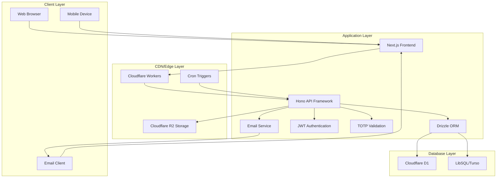

# Dropply

A secure file sharing platform built with Next.js and Cloudflare Workers. no accounts required.

## Features

- 🚀 **No Account Required**: Share files instantly without registration
- 🔐 **End-to-End Security**: Encrypted file storage with secure retrieval codes
- ⏰ **Auto-Delete**: Files automatically delete after expiration
- 📝 **Text & File Support**: Share both text snippets and files up to 5GB
- 📧 **Email Sharing**: Send retrieval codes directly via email (optional)
- 🔑 **TOTP Authentication**: Optional two-factor authentication for uploads
- 📱 **Mobile Responsive**: Works seamlessly on all devices
- 🌙 **Dark/Light Mode**: Adaptive theme support with smooth animations

## Architecture

### Tech Stack

- **Backend**: Cloudflare Workers + Hono.js framework
- **Frontend**: Next.js 15 + TypeScript + App Router  
- **UI Framework**: Custom component library with Tailwind CSS v4
- **Database**: Cloudflare D1 (SQLite) / LibSQL (Turso)
- **Storage**: Cloudflare R2 for file storage
- **Email**: Resend API for email sharing
- **Authentication**: JWT tokens with TOTP support
- **ORM**: Drizzle ORM - TypeScript-first database toolkit
- **Monorepo**: Turborepo with pnpm workspaces
- **Package Manager**: pnpm 10.15.0+ - Fast, disk-efficient
- **Node.js**: 20+ (specified in engines)
- **Code Quality**: Biome for formatting and linting

### System Diagram



## Project Structure

```
dropply/
├── apps/
│   ├── api/                    # Cloudflare Workers backend
│   │   ├── src/
│   │   │   ├── cron/          # Scheduled cleanup tasks
│   │   │   ├── database/      # Database schema and migrations
│   │   │   ├── lib/           # Shared utilities and helpers
│   │   │   ├── routes/        # API route handlers
│   │   │   ├── types/         # TypeScript type definitions
│   │   │   ├── global.ts      # Global logger configuration
│   │   │   └── index.ts       # Hono application entry point
│   │   ├── wrangler.jsonc     # Cloudflare Workers configuration
│   │   └── package.json
│   └── web/                   # Next.js frontend application
│       ├── src/
│       │   ├── app/          # Next.js App Router pages
│       │   ├── components/   # Reusable React components
│       │   ├── hooks/        # Custom React hooks
│       │   └── lib/          # Frontend utilities and API client
│       └── package.json
├── packages/
│   ├── tsconfig/             # Shared TypeScript configurations
│   ├── ui/                   # Shared UI component library
│   ├── uncrypto/            # Crypto utilities for Cloudflare Workers
│   └── utils/               # Shared utility functions and types
├── scripts/                 # Build and deployment scripts
├── turbo.json              # Turborepo configuration
└── pnpm-workspace.yaml     # pnpm workspace configuration
```

## Getting Started

### Prerequisites

- Node.js 20+
- pnpm 10.15.0+ package manager
- Cloudflare account (for deployment)

### Installation

```bash
# Clone the repository
git clone https://github.com/WuChenDi/dropply.git
cd dropply

# Install dependencies (pnpm will be managed by packageManager field)
pnpm install

# Copy environment variables
cp apps/api/.env.example apps/api/.env
cp apps/web/.env.example apps/web/.env
```

### Environment Configuration

**Backend Environment (`apps/api/.env`):**

```env
# The Service runtime preset to use for deployment.
# Options include:
# - 'cf': For deploying to Cloudflare.
# - 'node': For using the Node.js runtime.
# This variable allows you to dynamically select the appropriate runtime environment
# based on your deployment target.
DEPLOY_RUNTIME=cf

# Database Type
# Specify the type of database being used. Choose 'libsql' for LibSQL or 'd1' for Cloudflare D1.
# This determines which credentials and driver will be used in the configuration.
DB_TYPE=libsql

# LibSQL Configuration
# The URL for connecting to the LibSQL database. Default is a local SQLite file.
LIBSQL_URL=libsql://your-libsql-database-url
# The authentication token for accessing the LibSQL database.
LIBSQL_AUTH_TOKEN=your-libsql-auth-token

# Cloudflare Configuration
# The Cloudflare account ID for accessing Cloudflare services.
CLOUDFLARE_ACCOUNT_ID=
# The Cloudflare API token for authentication and authorization.
CLOUDFLARE_API_TOKEN=

REQUIRE_TOTP=false
JWT_SECRET=your-jwt-secret
TOTP_SECRETS=your-totp-secrets

```

**Cloudflare Workers Configuration (`apps/api/wrangler.jsonc`):**

```jsonc
{
  "$schema": "node_modules/wrangler/config-schema.json",
  "name": "dropply-api",
  "main": "src/index.ts",
  "compatibility_date": "2025-08-21",
  "compatibility_flags": ["nodejs_compat"],
  "vars": {
    // The Service runtime preset to use for deployment.
    "DEPLOY_RUNTIME": "cf",
    // Database Type
    "DB_TYPE": "libsql",
    // LibSQL Configuration
    // The URL for connecting to the LibSQL database. Default is a local SQLite file.
    "LIBSQL_URL": "your_libsql_url",
    // The authentication token for accessing the LibSQL
    "LIBSQL_AUTH_TOKEN": "your_libsql_auth_token",

    "REQUIRE_TOTP": "false",
    "JWT_SECRET": "your_jwt_secret",
    "TOTP_SECRETS": "your_totp_secrets",

    // Email Configuration
    "ENABLE_EMAIL_SHARE": "false",
    "RESEND_API_KEY": "your_resend_api_key",
    "RESEND_FROM_EMAIL": "noreply@resend.dev",
    "RESEND_WEB_URL": "your_resend_web_url"
  },
  "r2_buckets": [
    {
      "binding": "R2_STORAGE",
      "bucket_name": "dropply"
    }
  ],
  // "d1_databases": [
  //   {
  //     "binding": "DB",
  //     "database_name": "dropply",
  //     "migrations_dir": "./src/database",
  //     "database_id": "your-d1-database-id"
  //   }
  // ],
  "triggers": {
    "crons": ["0 * * * *"]
  },
  "observability": {
    "enabled": true,
    "head_sampling_rate": 1
  }
}

```

**Frontend Environment (`apps/web/.env`):**

```env
NEXT_PUBLIC_API_URL=http://localhost:3000
```

### Development

1. **Start both applications simultaneously:**
```bash
pnpm dev
```

This command uses Turborepo to start both the backend API (port 3000) and frontend application (port 3001) concurrently.

2. **Access the application at `http://localhost:3001`**

### Database Setup

The application uses Drizzle ORM with either Cloudflare D1 or LibSQL:

```bash
# Navigate to API directory
cd apps/api

# Generate database migrations
pnpm drizzle-kit generate

# Run migrations (for LibSQL)
pnpm drizzle-kit migrate

# For Cloudflare D1 (production)
wrangler d1 create dropply-database
pnpm run cf:remotedb
```

## API Documentation

### Server Configuration

**GET** `/api/config`

Get server configuration and feature flags.

```json
{
  "code": 0,
  "message": "ok",
  "data": {
    "requireTOTP": false,
    "emailShareEnabled": true
  }
}
```

### File Management

**POST** `/api/chest`

Create new upload session with optional TOTP authentication.

**Request:**
```json
{
  "totpToken": "123456"  // Optional, required when REQUIRE_TOTP=true
}
```

**Response:**
```json
{
  "code": 0,
  "message": "ok",
  "data": {
    "sessionId": "uuid-v4-session-id",
    "uploadToken": "jwt-upload-token",
    "expiresIn": 86400
  }
}
```

**POST** `/api/chest/:sessionId/upload`

Upload files and text content to session.

**Headers:**
```
Authorization: Bearer <uploadToken>
Content-Type: multipart/form-data
```

**Form Data:**
- `files`: File uploads (multiple allowed)
- `textItems`: JSON array of text items `[{"content": "text", "filename": "name.txt"}]`

**Response:**
```json
{
  "code": 0,
  "message": "ok",
  "data": {
    "uploadedFiles": [
      {
        "fileId": "uuid-v4-file-id",
        "filename": "example.txt",
        "isText": true
      }
    ]
  }
}
```

**POST** `/api/chest/:sessionId/complete`

Complete upload and generate retrieval code.

**Headers:**
```
Authorization: Bearer <uploadToken>
```

**Request:**
```json
{
  "fileIds": ["file-uuid-1", "file-uuid-2"],
  "validityDays": 7  // 1, 3, 7, 15, or -1 (permanent)
}
```

**Response:**
```json
{
  "code": 0,
  "message": "ok",
  "data": {
    "retrievalCode": "A1B2C3",
    "expiryDate": "2025-01-31T12:00:00.000Z"
  }
}
```

### Multipart Upload (Large Files)

**POST** `/api/chest/:sessionId/multipart/create`

Initialize multipart upload for large files.

**Headers:**
```
Authorization: Bearer <uploadToken>
```

**Request:**
```json
{
  "filename": "large-file.zip",
  "mimeType": "application/zip",
  "fileSize": 1073741824
}
```

**Response:**
```json
{
  "code": 0,
  "message": "ok",
  "data": {
    "fileId": "uuid-v4-file-id",
    "uploadId": "multipart-jwt-token"
  }
}
```

**PUT** `/api/chest/:sessionId/multipart/:fileId/part/:partNumber`

Upload file part.

**Headers:**
```
Authorization: Bearer <multipartToken>
Content-Type: application/octet-stream
```

**Response:**
```json
{
  "code": 0,
  "message": "ok",
  "data": {
    "etag": "part-etag",
    "partNumber": 1
  }
}
```

**POST** `/api/chest/:sessionId/multipart/:fileId/complete`

Complete multipart upload.

**Headers:**
```
Authorization: Bearer <multipartToken>
```

**Request:**
```json
{
  "parts": [
    {
      "partNumber": 1,
      "etag": "part-etag-1"
    },
    {
      "partNumber": 2,
      "etag": "part-etag-2"
    }
  ]
}
```

**Response:**
```json
{
  "code": 0,
  "message": "ok",
  "data": {
    "fileId": "uuid-v4-file-id",
    "filename": "large-file.zip"
  }
}
```

### File Retrieval

**GET** `/api/retrieve/:retrievalCode`

Get files metadata by 6-character retrieval code.

**Response:**
```json
{
  "code": 0,
  "message": "ok",
  "data": {
    "files": [
      {
        "fileId": "uuid-v4-file-id",
        "filename": "example.txt",
        "size": 1024,
        "mimeType": "text/plain",
        "isText": true,
        "fileExtension": "txt"
      }
    ],
    "chestToken": "jwt-download-token",
    "expiryDate": "2025-01-31T12:00:00.000Z"
  }
}
```

**GET** `/api/download/:fileId`

Download specific file with token authentication.

**Headers:**
```
Authorization: Bearer <chestToken>
```

**Query Parameters:**
- `token`: Alternative to Authorization header
- `filename`: Override download filename

**Response:** Binary file content with appropriate headers

### Email Integration

**POST** `/api/email/share`

Send retrieval code via email with custom message.

**Request:**
```json
{
  "retrievalCode": "A1B2C3",
  "recipientEmail": "recipient@example.com",
  "recipientName": "John Doe",
  "senderName": "Jane Smith",
  "message": "Here are the files you requested."
}
```

**Response:**
```json
{
  "code": 0,
  "message": "ok",
  "data": {
    "sent": true,
    "message": "Email sent successfully!"
  }
}
```

## Database Schema

### Sessions Table

| Field            | Type    | Description                          |
| ---------------- | ------- | ------------------------------------ |
| `id`             | TEXT    | Primary key (UUID v4)                |
| `retrievalCode`  | TEXT    | Unique 6-character alphanumeric code |
| `uploadComplete` | INTEGER | Boolean flag (0/1)                   |
| `expiresAt`      | INTEGER | Unix timestamp, NULL for permanent   |
| `createdAt`      | INTEGER | Unix timestamp                       |
| `updatedAt`      | INTEGER | Unix timestamp                       |
| `isDeleted`      | INTEGER | Soft delete flag (0/1)               |

**Indexes:**
- `idx_sessions_retrieval_code` (unique): On `retrievalCode` field
- `idx_sessions_expires_at`: On `expiresAt` field for cleanup queries

### Files Table

| Field              | Type    | Description                     |
| ------------------ | ------- | ------------------------------- |
| `id`               | TEXT    | Primary key (UUID v4)           |
| `sessionId`        | TEXT    | Foreign key to sessions.id      |
| `originalFilename` | TEXT    | Original filename               |
| `mimeType`         | TEXT    | MIME type                       |
| `fileSize`         | INTEGER | Size in bytes                   |
| `fileExtension`    | TEXT    | File extension                  |
| `isText`           | INTEGER | 1 for text content, 0 for files |
| `createdAt`        | INTEGER | Unix timestamp                  |
| `updatedAt`        | INTEGER | Unix timestamp                  |
| `isDeleted`        | INTEGER | Soft delete flag (0/1)          |

**Indexes:**
- `idx_files_session_id`: On `sessionId` field for queries

### Database Utilities

- `notDeleted()`: Filters non-deleted records
- `softDelete()`: Performs soft deletion  
- `withNotDeleted()`: Applies soft delete filter to queries
- `withUpdatedTimestamp()`: Updates timestamps automatically
- `isExpired()`: Checks for expiration

## Security Features

### Authentication Flow

1. **Session Creation**: JWT upload token generated (24h validity)
2. **TOTP Verification**: Optional TOTP code validation using RFC 6238
3. **File Upload**: Token-based file upload with multipart support
4. **Retrieval**: Chest JWT token for download access (matches session expiry)

### Security Measures

- Files stored in Cloudflare R2 with session-based paths (`sessionId/fileId`)
- Automatic cleanup of expired sessions and files via cron job
- Soft deletion with permanent cleanup to maintain data integrity
- JWT token validation for all file operations
- No persistent user data or tracking cookies
- TOTP support for enhanced upload security

### Supported TOTP Apps

- Google Authenticator
- Authy  
- 1Password
- Microsoft Authenticator
- Any RFC 6238 compatible authenticator

## File Upload Configuration

### Upload Limits

- **Maximum file size**: 5GB per file
- **Chunk size**: 20MB for multipart uploads
- **Concurrent uploads**: Up to 3 files simultaneously  
- **Concurrent parts**: Up to 3 parts per large file for optimal performance

### Upload Strategy

- **Small files (≤20MB)**: Direct upload with progress tracking
- **Large files (>20MB)**: Automatic multipart upload with 20MB chunks
- **Text content**: Processed as individual text files with `.txt` extension

### Expiry Options

| Option    | Duration  | Description                                  |
| --------- | --------- | -------------------------------------------- |
| 1 Day     | 24 hours  | Files expire tomorrow                        |
| 3 Days    | 72 hours  | Files expire in 3 days                       |
| 1 Week    | 7 days    | Files expire in 1 week                       |
| 2 Weeks   | 14 days   | Files expire in 2 weeks                      |
| Permanent | No expiry | Files never expire (manual cleanup required) |

## Automated Maintenance

The system includes automated maintenance through Cloudflare Cron Triggers:

### Daily Cleanup Task

**Schedule**: Runs every hour (`0 * * * *`)

**Process:**
1. **Query expired links**: `WHERE isDeleted = 0 AND expiresAt < current_time`
2. **Query incomplete sessions**: Sessions without `uploadComplete = 1` older than 48 hours
3. **Batch processing**: 50 sessions per batch with 100ms delays to prevent system overload
4. **Soft delete**: Updates `isDeleted = 1` and `updatedAt = now()`
5. **R2 cleanup**: Removes all objects with prefix `sessionId/`
6. **Error handling**: Individual failures don't stop the entire process

**Cron Configuration:**
```jsonc
"triggers": {
  "crons": [
    "0 * * * *"  // Every hour
    // "0 0 * * *"     // Daily at midnight
    // "0 */12 * * *"  // Every 12 hours  
    // "0 0 * * 0"     // Weekly on Sunday
  ]
}
```

### Monitoring Cleanup

After deployment, monitor cleanup execution:

```bash
# View recent logs
wrangler tail

# Filter for cleanup logs  
wrangler tail --grep "cleanup"
```

**Expected Log Output:**
```json
{
  "message": "Cleanup completed successfully",
  "totalSessions": 15,
  "expiredSessions": 10,
  "incompleteSessions": 5,
  "deletedFiles": 42,
  "r2ObjectsDeleted": 42,
  "errors": []
}
```

## Deployment

### Cloudflare Workers (Backend)

1. **Configure Cloudflare Resources:**

```bash
# Create R2 bucket
wrangler r2 bucket create dropply

# For D1 database (if using D1)
wrangler d1 create dropply-database

# Generate migrations
cd apps/api
pnpm drizzle-kit generate

# Apply migrations to D1 (production)
pnpm run cf:remotedb
```

2. **Update `wrangler.jsonc` with your resource IDs**

3. **Deploy to Cloudflare:**
```bash
cd apps/api
pnpm deploy
```

### Frontend Deployment

**Cloudflare Pages:**

```bash
# Build command
pnpm build:web

# Output directory
apps/web/out

# Root directory
./

# Environment variables
NEXT_PUBLIC_API_URL=https://dropply-api.your-subdomain.workers.dev
```

### Post-Deployment Checklist

- ✅ Verify scheduled cleanup task is active in Cloudflare Dashboard
- ✅ Check initial cleanup execution in logs
- ✅ Test file upload and retrieval flow
- ✅ Verify email sharing functionality (if enabled)
- ✅ Test TOTP authentication (if enabled)
- ✅ Monitor cleanup task performance metrics
- ✅ Validate R2 file storage and cleanup

## Development Scripts

```bash
# Install dependencies
pnpm install

# Development mode (all apps)
pnpm dev

# Build all packages
pnpm build

# Build specific apps
pnpm build:api    # Deploy API to Cloudflare Workers
pnpm build:web    # Build web frontend only

# Type checking
pnpm check-types

# Code formatting and linting (using Biome)
pnpm format      # Format code
pnpm lint        # Check linting issues
pnpm lint:fix    # Fix linting issues automatically

# Clean build artifacts
pnpm clean

# Database operations (in apps/api directory)
cd apps/api
pnpm drizzle-kit generate    # Generate migrations
pnpm drizzle-kit migrate     # Apply migrations (LibSQL)
pnpm run cf:remotedb         # Apply migrations (D1)
```

### Turborepo Commands

```bash
# Run commands across all workspaces
turbo run build
turbo run dev
turbo run check-types

# Run commands for specific packages
turbo run build --filter=./apps/web
turbo run dev --filter=./apps/api

# Run with dependency graph awareness
turbo run build --filter=./apps/web...  # Build web and its dependencies
```

## 📜 License

[MIT](./LICENSE) License &copy; 2025-PRESENT [wudi](https://github.com/WuChenDi)
